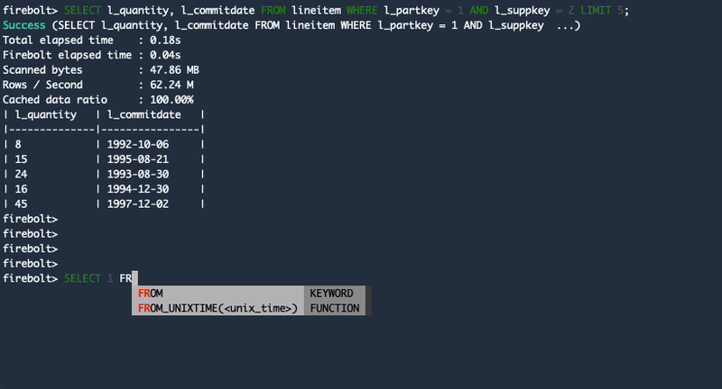

# Firebolt-CLI

[](https://github.com/firebolt-db/firebolt-cli/actions/workflows/nightly.yml)
[](https://github.com/firebolt-db/firebolt-cli/actions/workflows/unit-tests.yml)
[](https://github.com/firebolt-db/firebolt-cli/actions/workflows/code-check.yml)
[](https://github.com/firebolt-db/firebolt-cli/actions/workflows/security-scan.yml)
[](https://github.com/firebolt-db/firebolt-cli/actions/workflows/integration-tests.yml)


Firebolt cli is a tool for connecting to firebolt, managing firebolt resources, and executing queries from the command line.

## Quickstart

For detailed installation and usage instructions, see [Using the CLI](https://docs.firebolt.io/using-the-cli.html) in Firebolt documentation.

### Prerequisites

* `python>=3.7` and `pip` are required. See the [Python web page](https://www.python.org/downloads/).

* Running commands requires an active Firebolt account and a user with privileges to perform operations. For more information, see [Subscribing to Firebolt and creating an account](https://docs.firebolt.io/managing-your-account/creating-an-account.html).

### Installing using pip

```shell
$ pip install firebolt-cli
```

To verify, check the version.

```shell
$ firebolt --version
```

```shell
firebolt, version 0.6.0
```

### Setting configuration parameters

Use the `firebolt configure` command to set configuration defaults. You can override these when using a specific commands. For more information, see [Configuring CLI parameters](https://docs.firebolt.io/using-the-cli.html#configuring-cli-parameters) in Firebolt documentation.

## Interactive query


## Contributing

See: [CONTRIBUTING.MD](https://github.com/firebolt-db/firebolt-cli/tree/main/CONTRIBUTING.MD)
